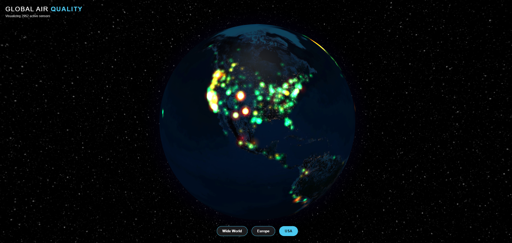

#  Global Air Quality 3D Visualizer

An interactive web application that visualizes real-time air quality data (PM2.5) on a 3D globe. The project uses data from the OpenAQ API and renders glowing points with dynamic colors based on pollution levels.

## Live Demo
You can see the project running here:  
[** View Live Deployment on Render**](https://air-quality-globe.onrender.com/)  
## Render Free Plan Notice

This project is deployed using **Render’s free plan**.

If there are **no incoming requests for 15 minutes**, Render automatically puts the server to sleep.  
As a result, **the first request after inactivity may take longer to load** while the server wakes up.

This behavior is **normal and expected**, and is a limitation of the free hosting plan—not a performance issue with the application itself.

## Features

- **Interactive 3D Globe:** Built with `react-globe.gl` and `Three.js`. Supports rotation and zoom.
- **Real Data:** Connection to the OpenAQ API v3 to fetch recent air quality measurements.
- **Data Visualization:**
  - **🟢 Green:** Good air quality (0–12 PM2.5)
  - **🟡 Yellow:** Moderate (12–35 PM2.5)
  - **🟠 Orange:** Unhealthy for sensitive groups (35–55 PM2.5)
  - **🔴 Red:** Unhealthy (>55 PM2.5)
- **Visual Effects:** Glowing particles created using custom Canvas textures.
- **Unified Architecture:** The backend (Node/Express) serves both the API and the frontend static files (React).

## Technologies Used

### Frontend
- React.js
- Three.js
- react-globe.gl
- CSS (Responsive design)

### Backend
- Node.js
- Express.js
- Axios (HTTP requests)
- Dotenv (Environment variable management)

### External API
- [OpenAQ API](https://openaq.org/) (Open air quality data)

---
