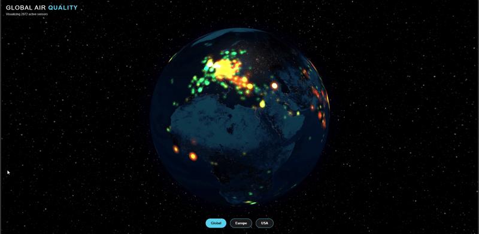

# Air Quality Globe – 3D Visualization Experiment

A small side project to explore 3D data visualization in the browser using real-time air quality data (PM2.5).

## Live Demo
You can see the project running here:  
[** View Live Deployment on Render**](https://air-quality-globe.onrender.com/)  

## Purpose

This project was built as a learning exercise to:
- Experiment with 3D visualization using Three.js
- Practice integrating a React frontend with a Node/Express backend

## Features

- **Interactive 3D Globe:** Built with `react-globe.gl` and `Three.js`. Supports rotation and zoom.
- **Real Data:** Connection to the OpenAQ API v3 to fetch recent air quality measurements.
- **Data Visualization:**
  - **🟢 Green:** Good air quality (0–12 PM2.5)
  - **🟡 Yellow:** Moderate (12–35 PM2.5)
  - **🟠 Orange:** Unhealthy for sensitive groups (35–55 PM2.5)
  - **🔴 Red:** Unhealthy (>55 PM2.5)

## Technologies Used

### Frontend
React.js, Three.js, react-globe.gl, CSS

### Backend
Node.js, Express.js, Axios

### External API
- [OpenAQ API](https://openaq.org/) (Open air quality data)

## Limitations
It is not intended to be a scientifically accurate air quality analysis tool.
- Data is visualized at a basic, per-measurement level
- No spatial interpolation or historical trend analysis
- No advanced performance optimizations
- No automated testing

The focus is on visualization and integration, not on analytical depth.

## Render Free Plan Notice
Deployed on Render (free plan, may take longer to load after inactivity).

---
